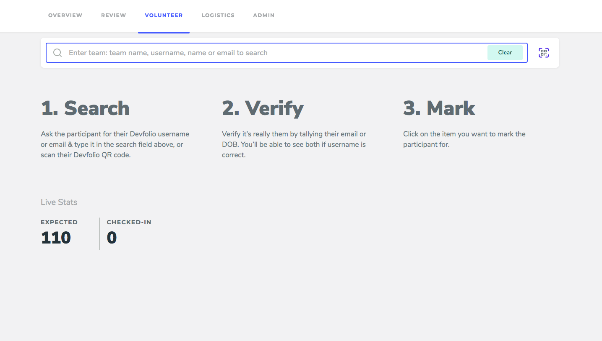
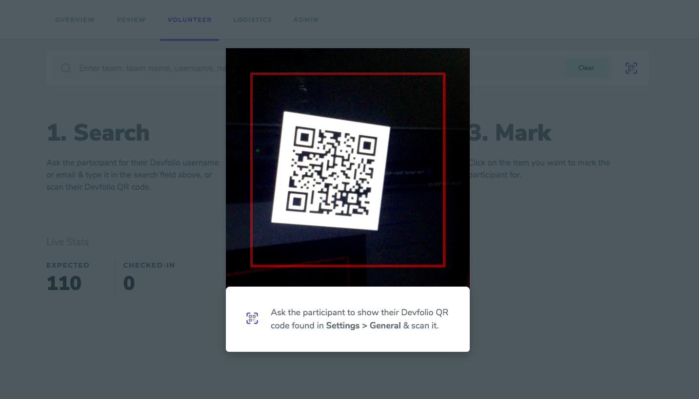
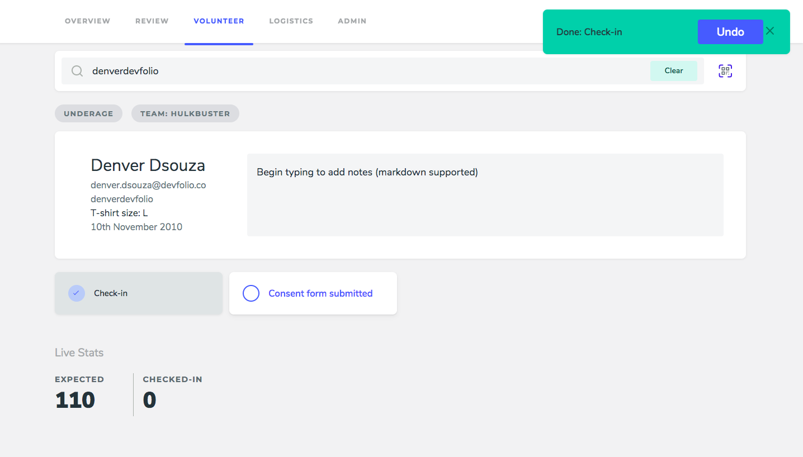
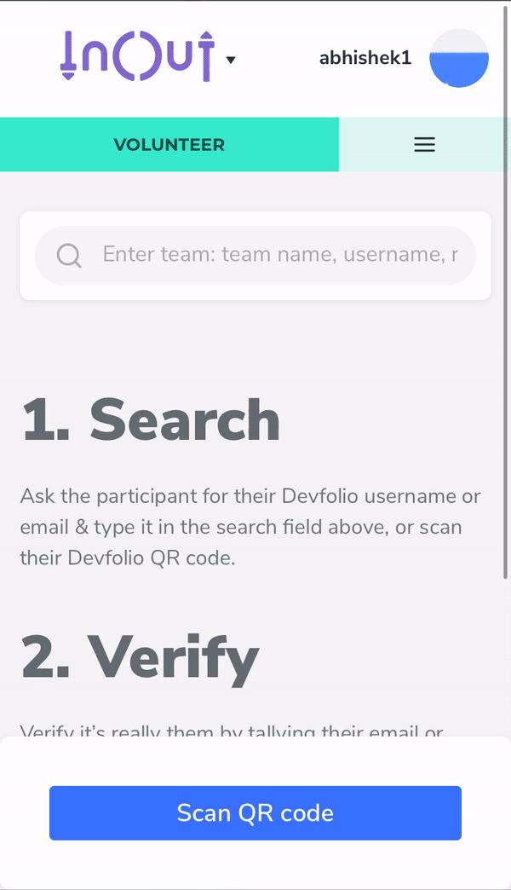

# Check-ins on Devfolio

Devfolio provides an easy way to keep track of the attendees physically present at the hackathon through the 'Volunteer' tab in the organizer dashboard. The 'expected' count at the bottom indicates the number of hackers who have confirmed their intention to attend the hackathon by completing the RSVP process.

**URL:** [https://org.devfolio.co/volunteer](https://org.devfolio.co/volunteer)

#### Check-ins in desktop mode: 

Hackers can be checked by entering their name, username, email-id or team name in the format - team:"team name". They can also be checked in using the QR code sent over to the hackers in their RSVP confirmation email or accessible on the hacker dashboard on the URL: [https://devfolio.co/settings](https://devfolio.co/settings)

The QR code option on the 'Volunteer' can be accessed on the desktop mode through the QR code symbol in the search bar. This leads to default usage of the desktop monitor for the scan. An external webcam may also be used for better results. 

Once their profile shows up, as shown above, they can be marked ‘Check-in’ by the volunteer. An option to undo the action will briefly show up in the top left corner which if ignored will make the 'Check-in' irreversible.

#### Check-ins on mobile devices:

Mobile devices are the preferable for check-ins as they allow for easy scanning using the mobile camera.

#### Points to note:

* ‘Check-ins’ are an individual level process that needs to be undertaken for all members of a team and individuals alike. 
* Apart from marking attendance of all those present physically at the venue, check-ins are essential to for hackers to be able to submit their projects on Devfolio. 
* 'Check-ins' ensure that hackers who don't attend the hackathon aren't able to submit project or be able claim that they attended the event.
* It's good practice to provide 'Volunteer' tab access to multiple volunteers through the 'Team' tab and get hackers checked-in as they arrive at the start of the hackathon.
* Since only hackers who have confirmed their intention of attending the hackathon are meant to attend it, only RSVP hackers with will show up in the ‘Volunteer’ tab. 
* If a hacker has been forgotten to RSVP their individual RSVP deadline can be extended by entering his/her details in 'admin' tab on the dashboard. 
* Hackers who haven't submitted their profile for review, haven't had their profile reviewed or have received rejection emails can't be checked-in. 

