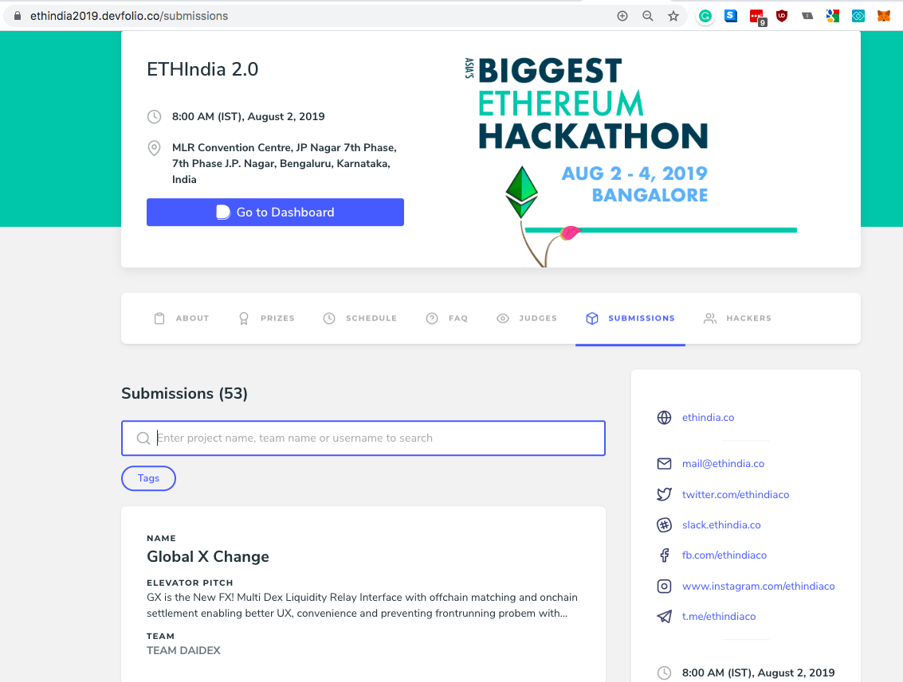
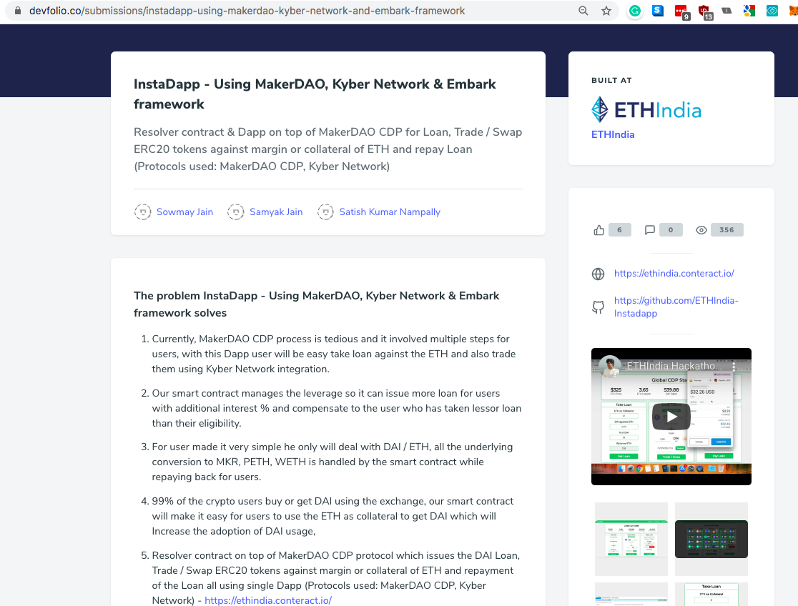
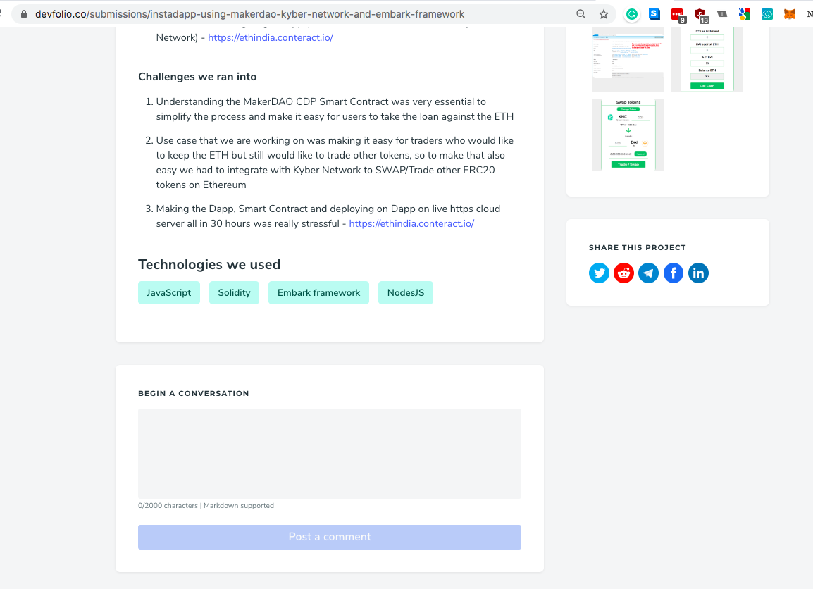

# Project Submissions on Devfolio

Devfolio lets hackers make project submissions to describe the hacks they've built over the course of the hackathon. 

#### Hackathon Public Subdomain:

All submissions are collated in the 'submissions' tab on the dedicated subdomain URL for the hackathon. This enables organizers to showcase all the projects built at their hackathons through the publicly shareable link and is a great metric to measure the success of a hackathon. Submissions are also searchable through the name of the project, team, or usernames of the hackers. Featured above are the submissions for ETHIndia 2.0 on the public subdomain - [https://ethindia2019.devfolio.co](https://ethindia2019.devfolio.co)

#### Project Submissions:

A unique URL is generated for every submission by a team of hackers where they can describe the purpose of their project, challenges they faced, technologies used, add screenshots/video links, and links to their code. Fellow hackers also have the ability to upvote the projects and comment on them. Since checked-in hackers can only make project submissions, it serves as proof of attending the hackathon.

#### Submission Process

The screenshots above describe how checked-in hackers can make final project submissions through their dashboard. 

#### Points to note:

1. Only teams that have been checked-in by the volunteering team will be eligible to submit their hack on Devfolio. The team leader will have the option to submit the hack enabled on his/her dashboard. 
2. Checked-in Individuals will have to join teams before the submission deadline to be able to submit their hack as individual submissions are not allowed.
3. Hackers can submit their hack at any point before the submission deadline. Submissions are not editable once submitted and cannot be resubmitted so that they need to be informed at least 2 hours before the submission deadline to start preparing their submissions to avoid last-minute issues.
4. The submissions will start showing up publicly on the hackathon subdomain as and when the hackers submit.
5. f there are any particular API prizes, the hackers are applying for they can include the same in 'technologies used' section. Submissions based on these tags can be tracked from the submission tab.

#### Troubleshooting common submission issues:

There are some cases in which teams may not see the submission link as active. Here are the common cases and how to troubleshoot them:

**Case 1:** Some team members are physically present at the venue but haven't been checked-in. The solution is to get them checked-in using the volunteer tab. If they haven't RSVPd, their RSVP process can be completed through the admin tab and they can be then checked-in

**Case 2:** Some team members are not attending the event. The solution is to ask the hackers to delete\(possible for admins\) or leave the existing team and form a new team with the checked-in members of the team at the venue. 

