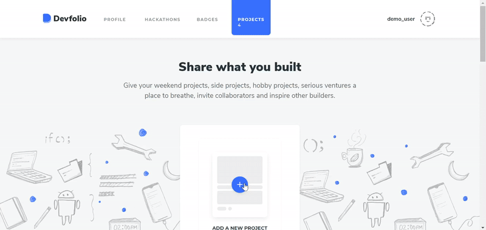
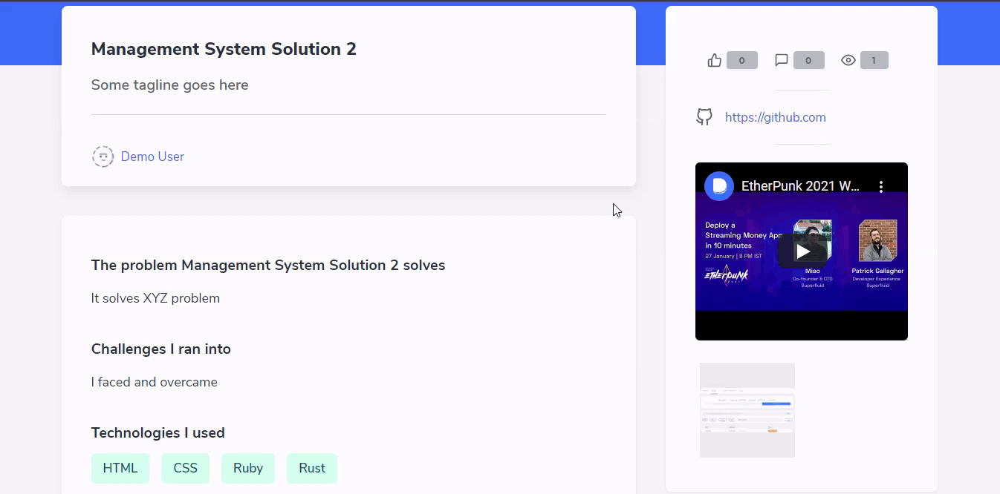
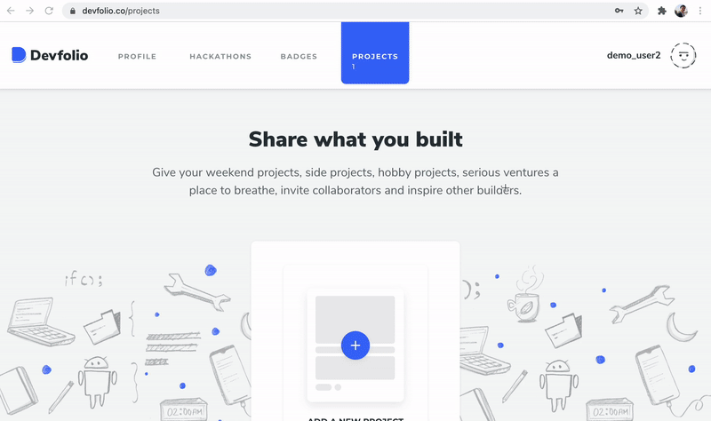

# Projects Tab

Have a project which you'd like to add to your Devfolio profile? You can simply add a project to Devfolio through the Projects Tab!

### Adding a Project

Here's the list of fields you'll be provided to fill in

* Name of project
* Tagline
* The problems it solves
* Challenges I ran into
* Technologies I used
* Links
* Video Demo
* Pictures

### Project Details Page

Your project can be accessed via the `Project Tab` or the `My Devfolio Tab`

### Project Stats

You can check the Views, Likes, and Comments of your project once you've uploaded it.

You can share your project on Twitter or LinkedIn directly, or copy the link to

### Update Project

Through the 'Project' tab, you can even update your projects and can tell your project viewers about the recent updates you made.

To know the process on how to add updates to the project, see the below GIF:

