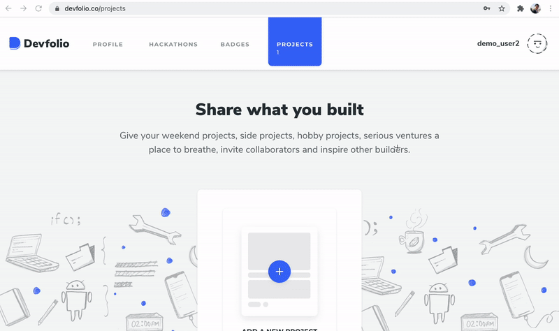

# 💪 Projects Tab

## Adding a Project

Here's the list of fields you'll be provided to fill in

* Name of project
* Tagline
* The problems it solves
* Challenges I ran into
* Technologies I used
* Links
* Video Demo
* Pictures

## Project Details Page

Your project can be accessed via the `Project Tab` or the `My Devfolio Tab`

.png>)

## Project Stats

You can check the Views, Likes, and Comments of your project once you've uploaded it.

.png>)

.png>)

You can share your project on Twitter or LinkedIn directly, or copy the link to

## Update Project

Through the 'Project' tab, you can even update your projects and can tell your project viewers about the recent updates you made.

.png>)

To know the process on how to add updates to the project, see the below GIF:

