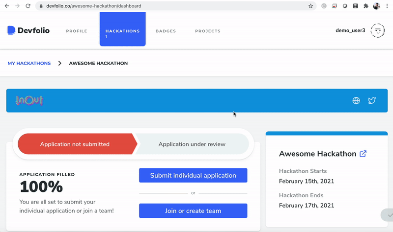

# 🔐 Applying To Online With Application Review Hackathons

Hackathons setup in `Online With Application Review` mode are strictly team hackathons.

You can apply to such hackathons individually and can get accepted, but in order to submit the project, it is mandatory to join/create a team.

## Applying as an Individual

## Apply as a Team

### Apply for the hackathon & create a team

### Ask your fellow hacker to join the team

### Team admin can now submit the team for review

Once accepted, you can RSVP within the time period allotted so that the organizer can check you in!


All the team members of the hackathon need to RSVP and be checked-in. Without that, the team won't be able to make a submission.


