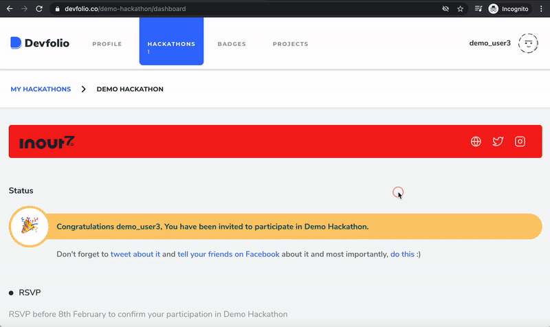
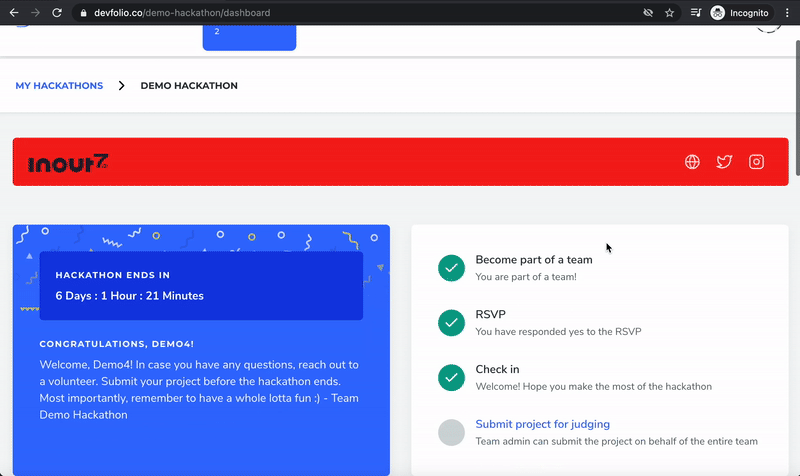

# Project Submission

## Submitting Project \[Online Mode\]

### **Submit your project individually**

### **Submit your project as a team**


Only team admin can submit the project on behalf of the whole team


## Submitting Project \[Online With Application Review & Offline\]

### **Step 1\) RSVP Individually**

### **Step 2\) Create or Join Team**

Read more about it here 👇🏻



### **Step 3\) Submitting Project**


Only the Team Admin will be able to make the submission for the entire team.


### Points to note

1. Only teams that have been checked-in by the volunteering team will be eligible to submit their hack on Devfolio.
2. Only the team leader will have the option to submit the hack through the dashboard.
3. Checked-in Individuals will have to join teams before the submission deadline to be able to submit their hack as individual submissions are not allowed.
4. Hackers can submit their hack at any point before the submission deadline.
5. The submissions will start showing up publicly on the hackathon subdomain as and when the hackers submit.
6. If there are any particular API prizes, the hackers are applying for they can include the same in `technologies used` section. Submissions based on these tags can be tracked from the submission tab. \(Review the above GIF for clear understanding\)

