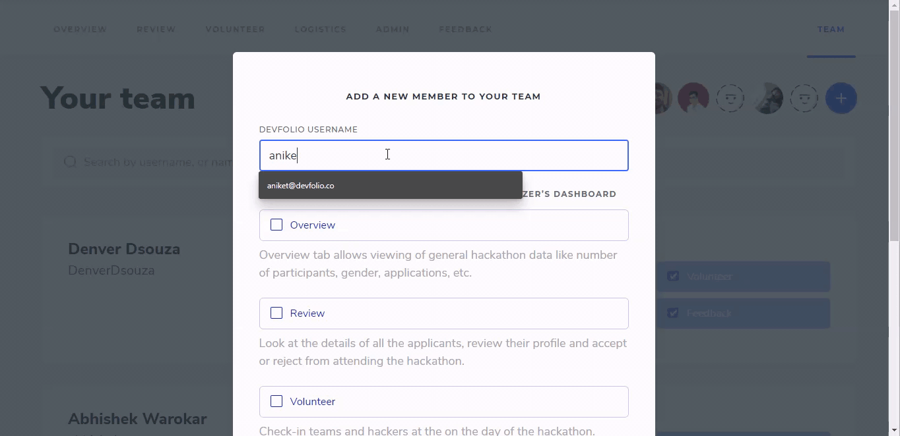
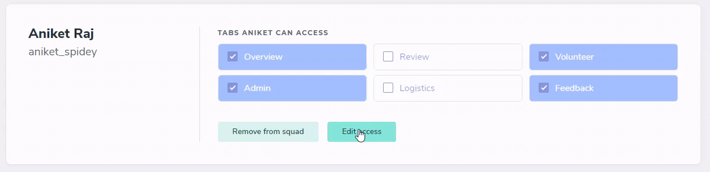
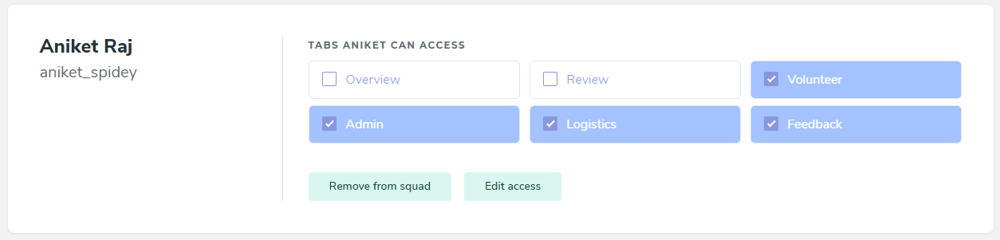

# Team Tab


The Team Tab will only be visible to the creator of the hackathon 


## Add Users To the Organizer Dashboard

The Devfolio Username of the organizer will be required to add them to the team

As demonstrated above, the modular permission allows you to provide them access tab-wise i.e. which tabs of the organizer dashboard should they be able to access.

## Editing Access

The `Edit Access` will allow you to edit the permissions you've provided the member earlier with.

## Revoke Access

The `Remove from Squad` will remove the team member from the dashboard, making it inaccessible to them.

