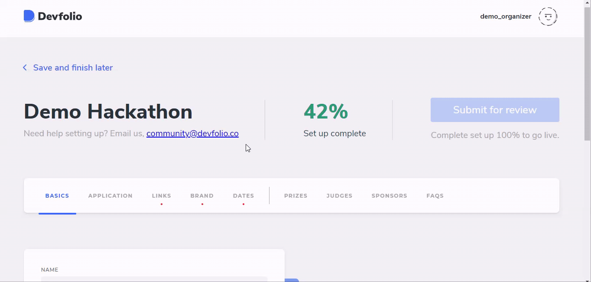

# Basics Tab

These details will be visible on the subdomain hosted once the hackathon is live. The following details would be included:

* Name - Name of the hackathon
* Tagline
* About \(Markdown Supported\)
* Approximate participants
* Minimum Team Size Allowed
* Maximum Team Size Allowed
* Where the hackathon is happening? \(Only for offline hackathons\)


The `About` section defines your hackathon mission, vision, and other details, so make sure to fill it properly. Devfolio supports markdown for a better view.


## Result

