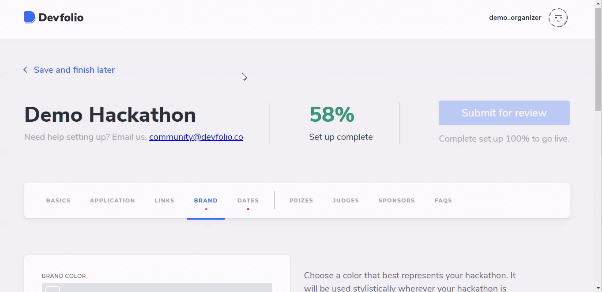

# Brand Tab

You can add your Hackathon Logo, as well as the Cover Image in this tab. In order to make it more customizable, you can enter the hex code for your brand colour, which will be added as a background colour on your hackathon's dashboard.

## Results

