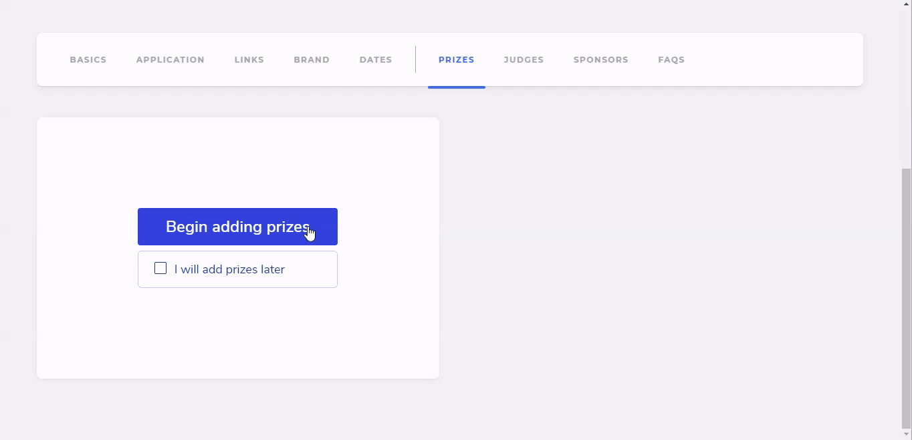
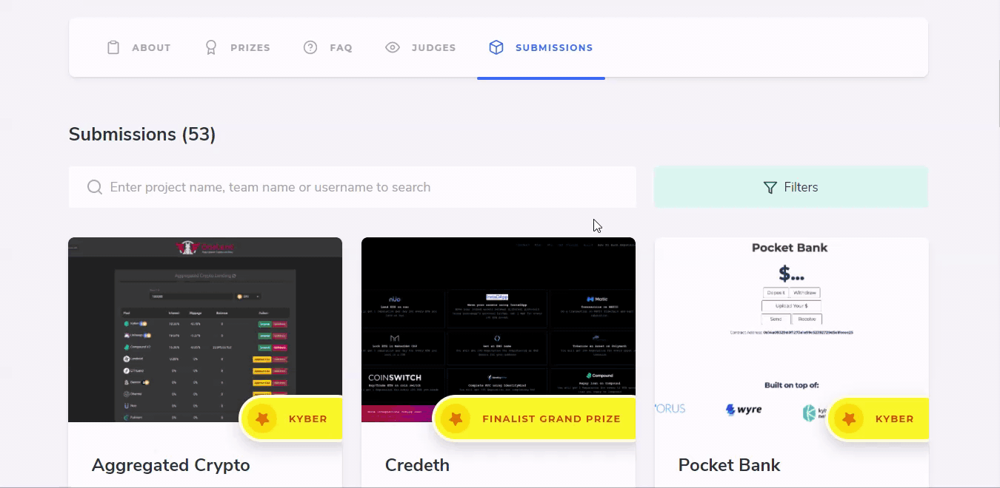

# Prizes Tab

Adding Prizes here is the best way of introducing Track Prizes in your Hackathon, so that if a hacker has built a project for a specific track, they can submit it to that once you add it here from your end.

Over here, we have created an API Prize for a company and marked it as a track/sponsor prize, so that hackers can specifically make a submission to that track.


Make sure to click on the `This is a track or sponsor prize` toggle for it to appear on the hackers' end


## Result

Once your hackathon is over, you can update this tab to announce the winners of your hackathon. Find more details here 👇

