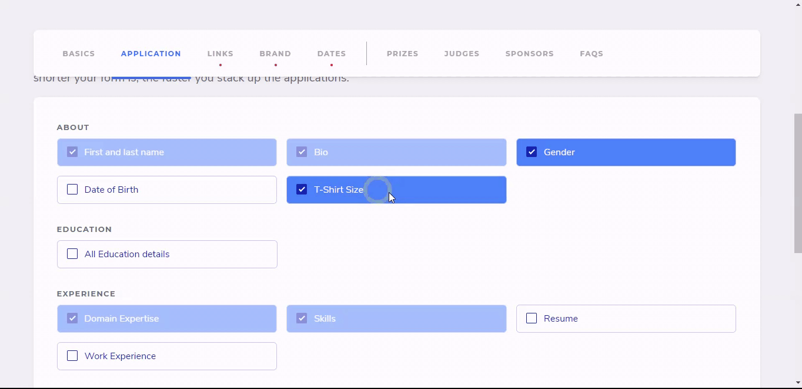
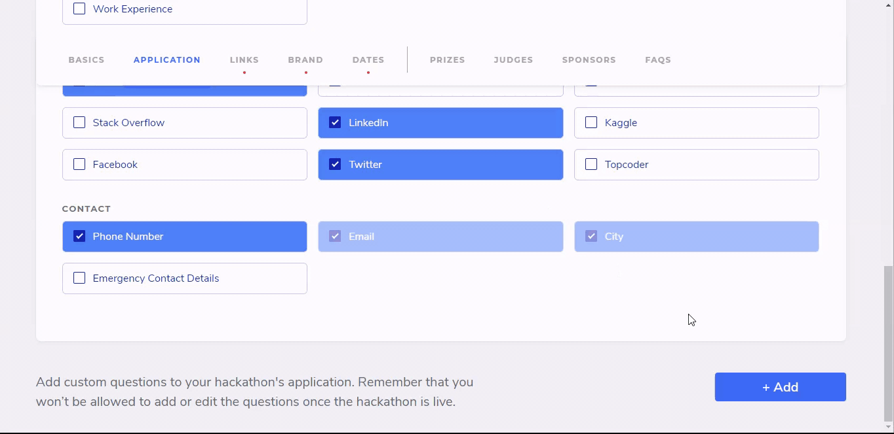

# Application Tab

## Using Built-in Fields for your Application

To help you save time, Devfolio provides you with built-in fields that are commonly used. You can decide what fields do the hackers need to fill in while applying for your hackathon.


The fields selected here are marked as mandatory! If you want to make them optional, you can proceed to add them as a custom question.


Here's how it will look like when the hacker fills out the application to your hackathon.

At times, the hackers may have already added some fields such as GitHub, LinkedIn links to their profile. So when they start filling out the application, the available details are directly taken from their profile and are not asked again while they fill out the application. The ones not available are then explicitly asked for.

## Adding Custom Questions


Pro Tip: You need not add custom questions for social media links if they're mandatory for your application since we have provided it in our pre-built fields


If you wish to create custom questions, you can proceed to do so by clicking on the `+ Add` button at the bottom. There are a variety of Field Types available to cater to most of your questions.

### **Field Type**

### **Question**

Add the question you'd like to ask the hacker

Results 👇🏻

### **Placeholder**

Add a sample response to provide more context to the hacker.

### Hint

Some questions require more information to be provided. You can add it as a Hint

Results 👇🏻


Make sure you check the `This is a required question` checkbox if you want to make the field compulsory


## Demo Application

Below are two hackathons that you can apply to. Feel free to submit projects at these hackathons, being mindful of the content since they'll be publicly visible.

* Online with Application Review: [https://awesome-hackathon.devfolio.co](https://awesome-hackathon.devfolio.co)
* Online: [https://awesome-online-hackathon.devfolio.co/](https://awesome-online-hackathon.devfolio.co/)

