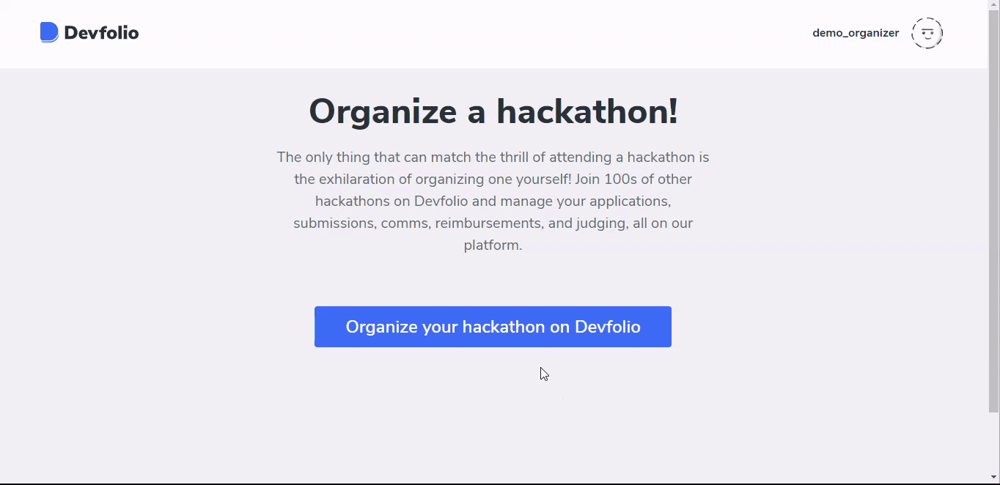

# Choose your Hackathon Mode


Before logging in to the Organizer Dashboard, make sure that you have already created a Devfolio Account.


Click on `Organize your Hackathon on Devfolio` and proceed to select the hackathon mode.


Once you select a Hackathon mode, you **won't be able to change** it later!


Start building your hackathon on [org.devfolio.co](http://org.devfolio.co)

If you want to know more about the Hackathon modes, check out the documentation here 👇🏻



