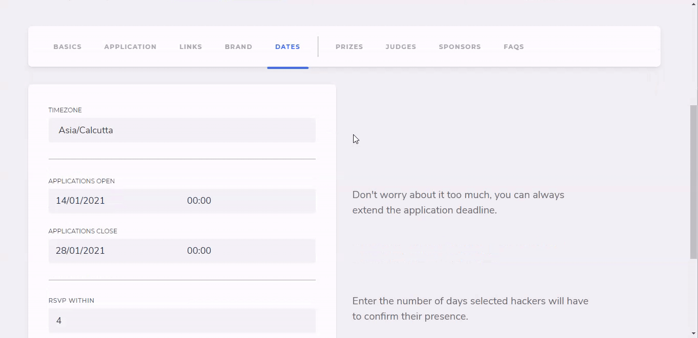

# 📅 Dates Tab

Fill in the relevant dates as per your hackathon's schedule.

| Date Title         | Description                                                                       | Can be updated later? |
| ------------------ | --------------------------------------------------------------------------------- | --------------------- |
| Application Open   | The date and time at which your hackathon will begin accepting applications       | ❌                     |
| Application Close  | The date and time at which your hackathon will stop accepting applications        | ✅                     |
| Hackathon Begins   | The date and time at which your hackathon kicks-off                               | ❌                     |
| Hackathon Deadline | The date and time at which your hackathon will stop accepting project submissions | ✅                     |

## RSVP **\[Only for Offline and Online with Application Review]**

`RSVP Within`: Number of days selected hackers will have to confirm their presence after their acceptance to the hackathon&#x20;


The optimal number of days to `RSVP within` is `4 days`. **\[Only for Offline and Online with Application Review]**

