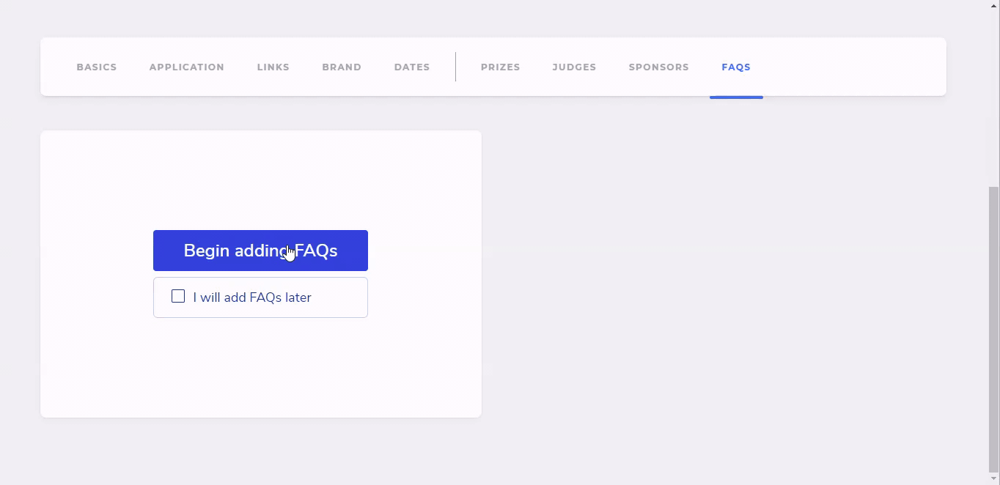

# 🙋‍♂️ FAQs Tab

It's always better to have a bunch of FAQs displayed on your dashboard to resolve the most common queries amongst hackers.

Click on `Begin adding FAQs` to open up a modal.

* **Question**
* **Answer** \(Markdown Format Supported\)

You can add as many FAQs as you want by click on the `Add` button towards the extreme right.

## Results

