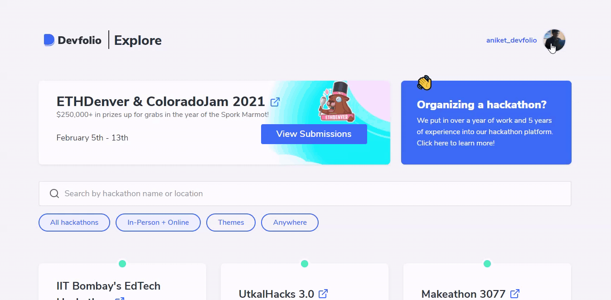

# 🏁 Getting Started

To start setting up your hackathon, click on `Organizer Dashboard` from the dropdown located at the top-right corner.

## Name and Hackathon Mode

Click on `Organize your Hackathon on Devfolio` and proceed to add the name of your hackathon and select the hackathon mode.


Once you select a Hackathon mode, you **won't be able to change** it later!


If you want to know more about the **Hackathon modes**, check out the documentation here 👇🏻



