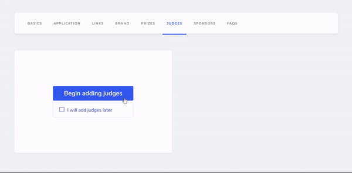

# 👩‍⚖️ Judges Tab

Showcase the stellar line-up of judges you have at your hackathon by publishing it on your dashboard.

You can use this to add the speakers at your hackathon as well.

Click on `Begin adding judges` and proceed to add the following details:

* **Name**
* **Job Title / Role**: Designation of the person
* **Company / Organization**
* **Company URL**: The website of the company the judge represents
* **Profile URL**: Their social media handles \(Twitter, Personal Website, LinkedIn\)
* **About** \(Optional\): A short description to introduce them
* **Image**: You can upload a image in .png or .jpg format \(Recommended dimensions: 64x64\)

