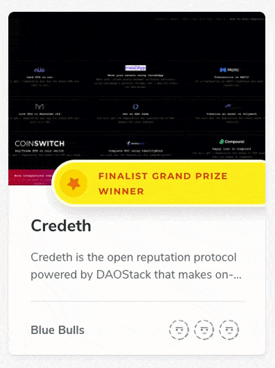
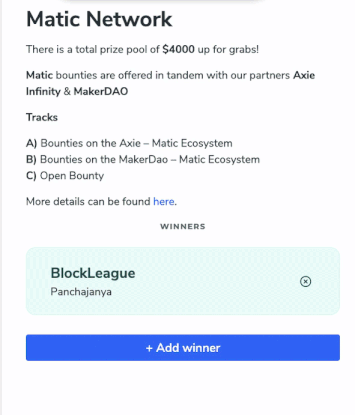

# Announcing the Winners


The winners can be added only by the creator of the hackathon.


Here are the simple steps to follow to announce the winners of your hackathon:

### Step 1\) Login

Login as an Organizer on Devfolio \([https://org.devfolio.co](https://org.devfolio.co)\)

### Step 2\) Update Button

Click on the `Update` button present on your hackathon

### Step 3\) Update Winners

Go to the prizes tab and select the prize you want to update with winners. You can:

* Create a new prize category

* Add winners to an existing prize category

* Update winners in a prize category

You can add a winner by entering the project name or team name.

Voila! Looks perfect, doesn't it!?

