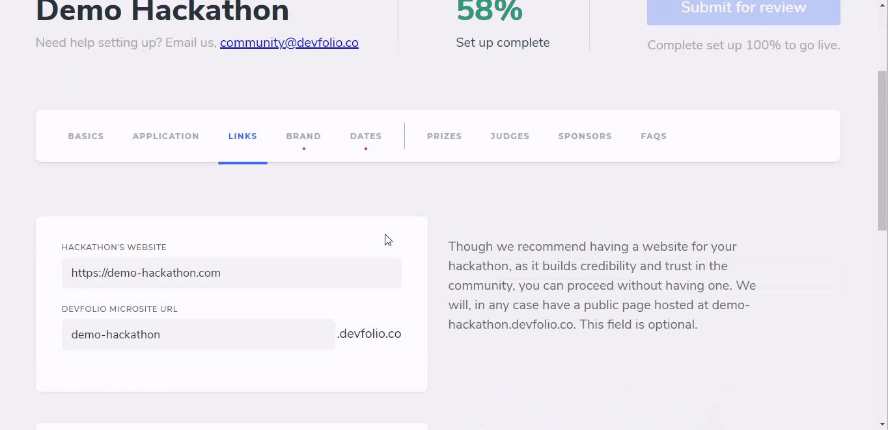

# Links Tab

All the relevant links regarding your hackathon should be filled here.

Although most of the fields are not required, we recommend adding as much information available for maximum reference.

## Devfolio Microsite URL

If your hackathon doesn't have a website of its own, we've got you covered. Upon creating a hackathon on Devfolio, you're provided with a public page hosted at `your-hackathon-name`.devfolio.co


`your-hackathon-name`will be your **Hackathon's slug**.


You can make announcements by sending out emails to the participants of your hackathon. The emails will be sent out through the email ID you provide in the `Contact Email` field.


Make sure you input a valid e-mail ID here.


We encourage organizers to have a Code of Conduct for the hackers to adhere to. If you don't have one, you can use [Devfolio's standard Code of Conduct](https://devfolio.co/code-of-conduct) by clicking on the checkbox.

