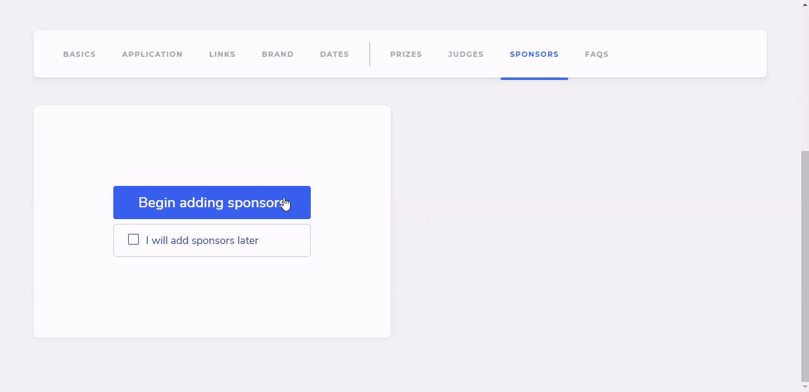
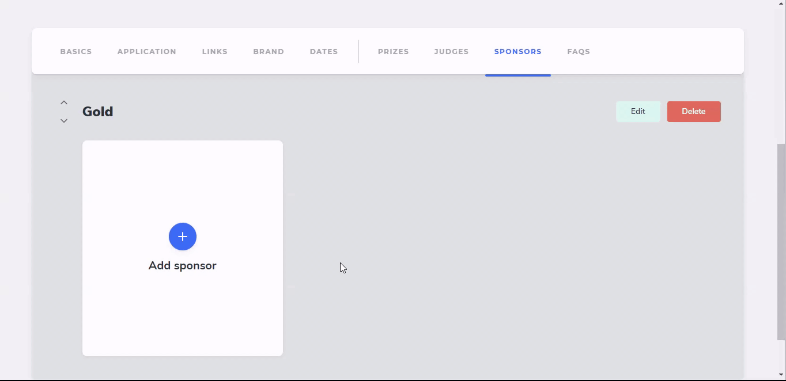
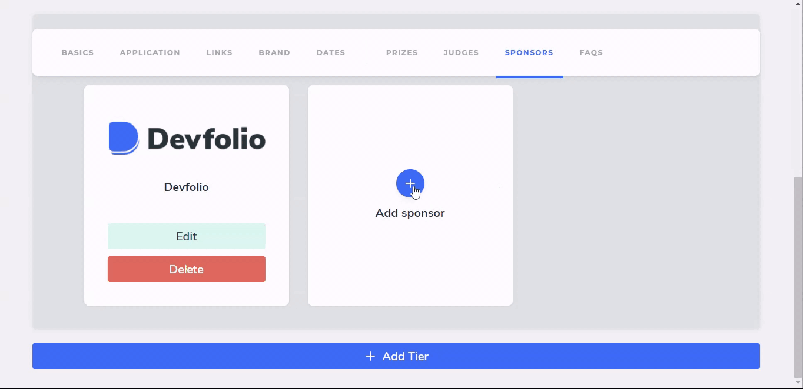

# Sponsors Tab

You can showcase the sponsors on your microsite by updating the Sponsors Tab.

## Create a Tier

Click on `Begin adding sponsors` to create a Sponsor Tier.

* **Tier Name**: Gold, Silver, Mega, Platinum, anything!
* **Sponsor Logo Size:** The number of sponsors to be added to the tier.

## Add a sponsor to the tiers

Click on the `+ sign` to add a sponsor to the respective tier, and proceed to add the details.

* **Sponsor Name**
* **Sponsor Logo**
* **Company / Organization**

## Create additional Sponsors and Tiers

Once you have added your first sponsor, you can proceed to add more sponsors to the same tier, or click on the `+ Add Tier` button to add more tiers.


If the logo doesn't show up as expected, you can edit it over here.


